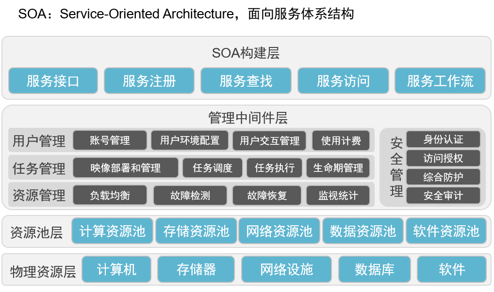
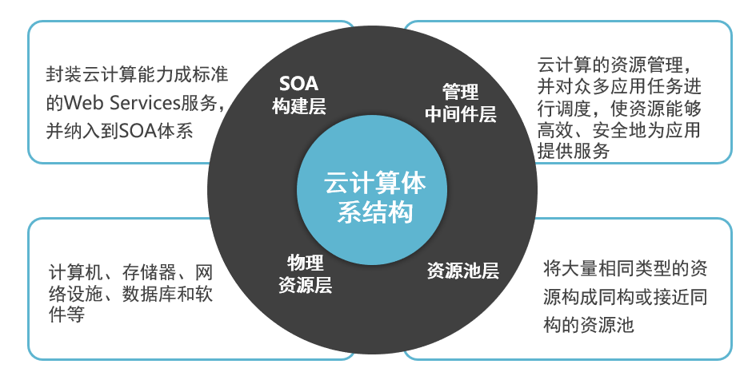

# 云计算作业

## 2021.09.07

```
Outline:

大数据的定义及特征；
云计算的定义及特征；
云计算与大数据的关系；
云计算服务的三种类型；
云计算的体系结构；
云计算据中心与传统数据中心的优势；
```

**大数据的定义及特征；**d

定义：海量数据或巨量数据，其规模巨大到无法通过目前主流的计算机系统在合理时间内获取、存储、管理、处理并提炼以帮助使用者决策。

特征：

- 价值密度低（**V**alue）
- 快速（**V**elocity）
- 复杂度（**C**omplexity）
- 数据量大（**V**olume）
- 多样（**V**ariety）

**云计算的定义及特征；**

定义：云计算是一种商业计算模型。它将计算任务分布在大量计算机构成的资源池上，使各种应用系统能够根据需要获取计算力、存储空间和信息服务。

定义：云计算是通过网络按需提供可动态伸缩的廉价计算服务。

7个特点：超大规模、虚拟化、高可靠性、通用性、高可伸缩性、按需服务、极其廉价

**云计算与大数据的关系；**

大数据是原始资源，云计算是处理大数据的手段。

**云计算服务的三种类型；**

按服务类型分

1. 将软件作为服务SaaS（Software as a Service）针对性更强，它将某些特定应用软件功能封装成服务

2. 将平台作为服务PaaS（Platform as a Service）对资源的抽象层次更进一步，提供用户应用程序运行环境

3. 将基础设施作为服务IaaS（Infrastructure as a Service）将硬件设备等基础资源封装成服务供用户使用

云计算按部署模式分

1. 私有云Private Cloud
2. 公有云Public Cloud
3. 混合云Hybrid Cloud

**云计算的体系结构；**

技术体系：





**云计算据中心与传统数据中心的优势；**

硬件成本低、电价低、管理费用低，资源利用率高