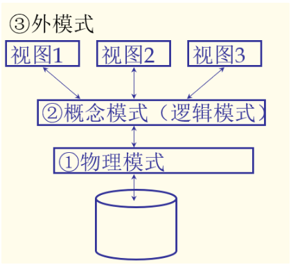

## Introduction

任何一个数据库系统必须支持某种数据模型，数据模型是数据库的基础和核心。

什么是数据库（DataBase）？

- 是一个大规模的、集成的数据集合

数据库的作用？

- 在计算机中对现实世界中一个企业或者机关单位的建模

包括：实体entity（学生、老师、教师）和联系ralationship（事物之间的关系）

什么是数据库管理系统？

- DBMS是用来存储和管理数据库的系统软件。

文件 vs 数据库？（为什么不用文件存储数据？）

计算机中的文件就是一段字符流。没有很强的数据管理功能，但是在实际应用中，需要的操作是非常复杂的，文件不能提供。

- DBMS提供了很多的便捷功能。
- DBMS中针对不同的文件结构不用设计不同的查询算法。
- 避免多个用户在操作同一个数据库（文件）的时候产生不同的结果（多用户的并发访问不会破坏数据库的一致性）
- 故障恢复（文件系统没有这个能力，DBMS会自动恢复数据库中的数据）
- 安全和访问控制（DBMS有些数据需要授权才能访问，保证的数据的安全性）

数据库系统是建立在操作系统的文件系统之上的。

为什么使用数据库管理系统（DBMS）？

- 数据独立性和有效访问
- 减少应用开发的时间
- 数据的完整性和安全性
- 统一的数据管理
- 支持并发访问和故障回复 等

数据（Data）、数据模型（DataModule）、数据模式（DateSchema）

- **数据**是用来描述现实世界的一种符号，是信息存在的形式。

- **数据模型**是用来描述数据的一组概念和定义。（可以理解为一种数据结构，用来描述世界的一种方法）

- **数据模式**用数据模型对一个集合进行描述所产生的结果。

- 关系模式

    是目前使用最广泛的模型。

    - 主要概念：关系，基本包含一个列和一个表
    - 每一个关系都有一个模式，用于描述列或者字段

数据的抽象级别【三级模式】

① 物理模式。描述了数据在磁盘上是怎么存储的，使用一个堆文件来存，还是用哈希文件来存，一旦确定了一个模式（存储结构），物理模式就形成了“描述所使用的文件和索引”

② 概念模式。拿关系型数据库举例，这个数据库中有多少张表，每张表的长度是多少，等等，是逻辑模式“逻辑结构”

③ 外模式是最终给用户所看到的样子。“用户如何查看数据”

概念模式中的表叫做基表，是真正存储在磁盘中的。

外模式不一定，外模式长什么样子，可以根据用户的不同而不同。

举例：用来存放大学信息的数据库。

- 物理模式
    - 以无序文件的形式存放的字段之间的关系
    - 索引为学生的第一列
- 概念模式（逻辑模式）
    - Students(sid: string, name: string, login: string, age: integer, gpa:real)
    - Courses(cid: string, cname:string, credits:integer)
    - Enrolled(sid:string, cid:string, grade:integer)
- 外模式（只让用户看到的）
    - Course_info(cid:string,enrollment:integer)

数据独立性

应用程序和数据的存储程序和存储结构之间可以是相互隔离的，这种隔离叫做数据独立性。

原因：是由于数据库中存在着三级模式，三级模式中存在着两级映射

这是用DBMS管理数据库的**最重要的好处**之一。

**逻辑数据独立性**：在一个数据库系统之上开发的应用程序，可以不受数据库中数据逻辑结构变化的影响。应用程序都是基于外模式（视图）开发的，当一个数据库的逻辑结构发生了改变，只要改变映射关系，保证视图不变，在这个视图的基础上开发的应用程序就不受影响。

**物理数据独立性**：当数据的物理存储结构发生变化的时候，基于这个数据库开发的应用程序就没有影响。存储结构的变化不影响表的逻辑结构。

数据库系统

什么是数据库系统？

一个数据库系统是由DBMS以及其管理的数据、和在DBMS的基础上所开发的应用程序，以及DBA，这些东西组合在一起，叫做一个数据库系统。

DBMS是一个核心，它有如下特性：

- 提供了高级的用户接口（文件提供的是底层的低级的访问接口）
- 支持有效的查询处理和优化【关键】
- 支持有效的目录管理，使得数据库的高层的概念能和底层的文件系统进行映射
- 有效的并发控制和恢复功能
- 支持完整性约束的检查
- 完善的访问控制（只有经过授权的合法用户才能访问其可以访问的数据）

数据库系统的生命周期

- 数据库系统的规划阶段
- 数据库设计
- 建立和加载
- 运行\管理和维护
- 扩展和重构
- 