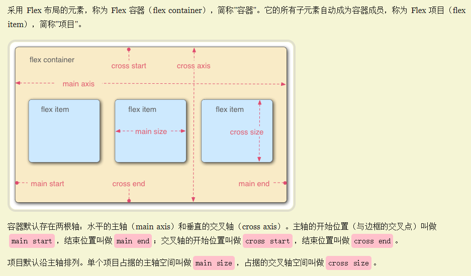
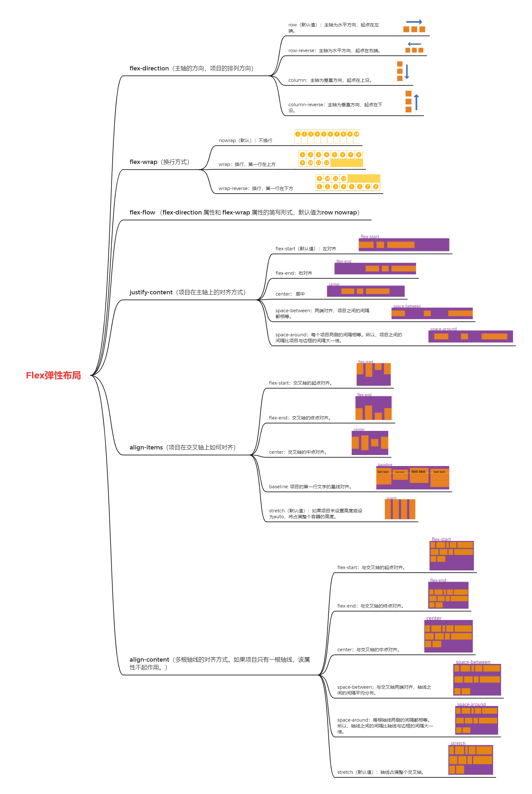
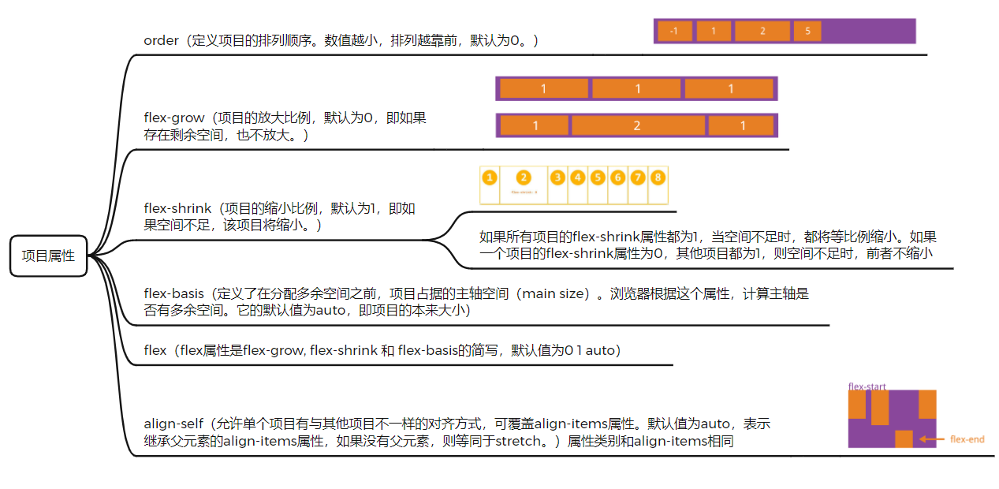

# CSS3高级

## 计量单位

视口：浏览器的可视区域的大小/移动端的LayoutViewport，也就是 `window.innerWidth/window.innerHeight` 的大小，不包括标题栏和工具栏

vw和vh

1. vw：1vw等于视口宽度的1%。
2. vh：1vh等于视口高度的1%。
3. vmin：选取vw和vh中最小的那个。
4. vmax：选取vw和vh中最大的那个。

## 布局

### Flex弹性盒模型

### Grid 网格布局

## 帧动画

