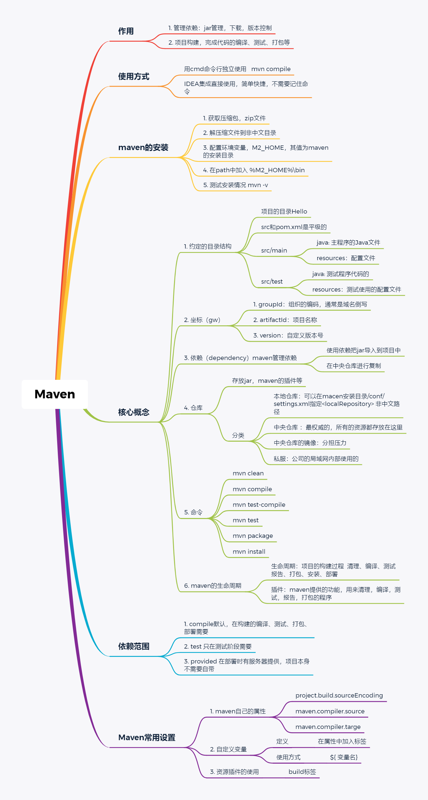

# Maven



## 简介


是什么？Maven 是一个项目管理工具


传统的项目开发（没有使用maven）存在的问题

- 有很多模块，模块之间存在关系，手动管理关系比较繁琐
- 需要很多第三方功能，很多jar文件，需要手动从网络上获取所有的jar文件
- 需要管理jar的版本
- 需要管理jar的依赖

使用maven的优点

- 自动管理jar文件
- 自动下载jar文件和源码
- 自动管理jar的依赖和版本
- 自动编译为class
- 测试代码是否正确
- 帮你打包文件形成jar文件或者war文件
- 帮你部署项目


构建：项目的构建。

构建是面向过程的，就是一些步骤，完成项目代码的编译，测试，运行，打包，部署等等。

maven支持的构建包括有：

1. 清理，把之前项目编译的东西删除掉，为新的编译代码做准备。

2. 编译，把程序源代码编译为执行代码，java-class文件批量的，maven可以同时把成千上百的文件编译为class。javac不一样，javac一次编译一个文件。

3. 测试，maven可以执行测试程序代码，验证你的功能是否正确。批量的，maven同时执行多个测试代码，同时测试很多功能。

4. 报告，生成测试结果的文件，测试通过没有。

5. 打包，把你的项目中所有的class文件，配置文件等所有资源放到一个压缩文件中。这个压缩文件就是项目的结果文件，通常java程序，压缩文件是jar扩展名的。对于web应用，压缩文件扩展名是.war

6. 安装，把5中生成的文件war，war安装到本机仓库

7. 部著，把程序安装好可以执行。// 这个用maven比较麻烦，通常手工完成


核心概念：

1. POM。是一个文件，名称是 pom.xml，翻译过来叫做项目对项目模型，maven把一个项目当作一个模型使用，控制maven构建项目的过程，管理jar依赖。
2. 约定的目录结构。maven项目的目录和文件的位置都是规定的。
3. 坐标。是一个唯一的字符串，用来表示资源的。
4. 依赖管理。管理你的项目可以使用的jar文件。
5. 仓库管理（了解）。资源存放的位置
6. 生命周期（了解）。maven工具构建项目的过程就是生命周期。
7. 插件和目标（了解）。执行maven构建的时候用的工具就是插件。
8. 继承。
9. 聚合。


**maven的安装和配置**

下载：直接官网上下载（10M）就行

子目录介绍：

- bin：执行程序，主要是mvn.cmd
- conf：maven本身的配置文件 settings.xml

配置：

在系统的环境变量中的指定一个M2_HOME的名称，指向maven主目录


然后在path中加入bin目录


必须有JAVA_HOME环境变量


出现如下内容说明安装配置正确


## Maven核心概念

### Maven约定目录结构

每一个maven的项目在磁盘中都是一个文件夹


执行tree命令


在main\java中创建了一个package，里面写上测试代码

使用命令行 *mvn compile* 编译main\java中的**所有**java程序

此时会发现正在下载大量的东西，问题：为什么要下载这些东西？下载了什么？下载完成之后这些东西存到哪里了？

为什么要下载？因为maven工具的执行需要用到很多的插件（java类--jar文件）

下载什么？jar文件，插件。用来完成某些功能

下载到哪里了？默认放在C盘 \ 用户 \ .m2 \ respository（本机仓库）

执行了mvn compile之后，在项目的根目录下面生成了target目录，编译生成的所有文件都在里面。

设置本机的存放资源的目录位置：

1. 先备份，再修改maven安装目录/conf/settings.xml中的localRepository目录
   
- 最好把以后学习的所有框架的仓库都设为这个目录用来积累资源
  
1. 

    把这个标签移动到注释外面，并为其指定一个目录，注意整个路径中不要有中文（注意斜杠的方向）

2. 

### 仓库

1）仓库是什么：仓库是存放东西的，存放mavon使用的jar和我们项目使用的jar，maven使用的插件（各种）jar）

2）仓库的分类

- 本地仓库，就是你的个人计算机上的文件夹，存放各种ar
- 远程仓库，在互联网上的，使用网络才能使用的仓库
	①：中央仓库，最权威的，所有的开发人员都共享使用的一个集中的仓库，[中央仓库的地址](https://ropo.mavon.apache.org )
	②：中央仓库的镜像：就是中央仓库的备份，在各大洲，重要的城市都有镜像。
	⑤：私服，在公司内部，在局域网中使用的，不是对外使用的。

3）仓库的使用，maven仓库的使用不需要人为参与。开发人员需要使用mysql驱动——>maven首先查本地仓库——>私服——>镜像——>中央仓库

### POM文件

Project Object Model 项目对象模型。Maven把一个项目的结构和内容抽象为一个模型，在xml文件中进行声明以方便进行构建和描述。

pom.xml是Maven的灵魂。**maven环境搭建好之后，所有的学习和操作都是关于pom.xml的**


基本信息：

**modelVersion**

- Maven的模型版本,对Maven2和3来说,**只能是4.0.0**

***坐标（gav）***

**groupId**

- 组织id, 一般式公司域名的倒写, 格式可以为
    - 域名倒写. 例如 com.baidu
    - 域名倒写+项目名 如 com.baidu.baidusearch

- 项目名称（模块名称）

**version**

- 项目的版本号-如果项目还在开发中，是不稳定版本，通常在版本后加上`-SNAPSHOT`
- version使用三位数字表示，例如：`1.1.0`

\<groupId\>\<artifactId\>\<version\> 三个构成了Maven项目的坐标，坐标是唯一的，也决定着将来项目在仓库中的路径及名称

**packaging**

- 指定项目的压缩文件扩展名
- 项目打包的类型，可以是jar,war 等，默认是jar，web应用是war

**dependencies和dependency（*依赖*）**

Maven的一个重要作用就是管理jar包，为了一个项目可以构建或运行，项目中不可避免的，会依赖很多其他的jar包，在Maven中，这些jar就被称为依赖，使用标签dependency来配置。而这种依赖的配置正是通过坐标来定位的，由此我们也不难看出，maven把所有的jar包也都视为项目存在了。

如何配置该属性?

- 从官网上查找需要依赖的jar包[maven中央仓库](https://mvnrepository.com/),复制xml
- 

- 粘贴到项目的pom文件中，完成。


使用的时候，maven如何查找项目所需要的jar包?

- 坐标中的每一个属性都对应着一个文件夹，groupId中的每一个‘.’也代表一个文件夹。当编译的时候需要这些文件的时候，maven会首先查找本地仓库，即之前我们所设定的文件夹
- 在其中寻找 `mysql/mysql-connector-java/5.1.46` 目录，在其中寻找jar包
- 如果找到，就会自动加到你的项目中，如果没找到，就会按照私服——>镜像——>中央仓库的顺序下载jar包到本地仓库中，进行使用

**properties（*属性*）**

properties是用来定义一些配置属性的，例如project.build.sourceEncoding（项目构建源码编码方式），可以设置为UTF-8，防止中文乱码，也可定义相关构建版本号，便于日后统一升级。

---

以下作为了解

**build**

表示与构建相关的配置，例如设置编译插件的jdk版本


**parent（*继承*）**

在Maven中，如果多个模块都需要声明相同的配置，例如：groupId、version、有相同的依赖、或者相同的组件配置等，也有类似Java的继承机制，用parent声明要继承的父工程的pom配置。

**modules**

在Maven的多模块开发中，为了统一构建整个项目的所有模块，可以提供一个额外的模块，该模块打包方式为pom，并且在其中使用modules聚合的其它模块，这样通过本模块就可以一键自动识别模块间的依赖关系来构建所有模块，叫Maven的聚合。

---

### Maven的生命周期、命令

Maven的生命周期指的是用maven进行项目构建的过程，清理、编译、测试、报告、打包、安装、部署等过程

maven的命令：maven独立使用，通过命令完成maven的生命周期的执行，可以通过使用命令进行项目的清理， 编译，测试等

| 命令 | 作用 |
| ---- | ---- |
|mvn clean| 清理（会删除原来编译和测试的目录，即target目录，但是已经install到仓库里的包不会删除）（由插件完成真正的清理工作） |
|mvn compile|编译主程序（mian目录下的）（会在当前目录下生成一个target，里边存放编译主程序之后生成的字节码文件）<br/>编译main/java目录下的java为class文件，同时把class拷贝到target/classes目录下面。把main/resources目录下的文件都拷贝到target/classes下面|
|mvn test-compile|编译测试程序（test目录下的）（会在当前目录下生成一个target，里边存放编译测试程序之后生成的字节码文件）|
|mvn test|测试（会生成一个目录surefire-reports，保存测试结果）**当我们执行测试的时候，会自动执行一遍前面的所有命令（clean，compile，test-complile）**|
|mvn package|打包主程序（会编译、编译测试、测试、并且按照pom.xml配置把主程序打包生成jar包或者war包）<br />打包生成的jar中**只有src/main中的所有内容**，在打包的时候，坐标中的每一个属性都是一个文件夹，groupId中的一个‘.’ 也对应着一个文件夹|
|mvn install|安装主程序（会把本工程打包，并且按照本工程的坐标保存到本地仓库中，这样其他的项目就能使用这个jar包了，**也会把以前的所有命令执行一遍**）|
|mvn deploy | 部署主程序（会把本工程打包，按照本工程的坐标保存到本地库中，并且还会保存到私服仓库中。还会自动把项目部署到web容器中）。|

**在实际开发中用的mvn install比较多**

### 单元测试

测试方法：用的是junit，junit是一个专门测试的框架（工具）。

junit测试的内容：测试的是类中的方法，每一个方法都是独立测试的。方法是测试的基本单位（单元）。

maven借助单元测试，批量的测试你类中的大量方法是否符合预期的。


如何进行单元测试？

1. 使用junit包：在maven中央仓库找到所需要的junit的xml复制到我们的pom.xml文件的dependencies中（加入依赖项）


2. 在maven项目中的src/test/java目录下创建测试程序。推荐的创建类和方法的提示：

    1. 测试类的名称是`Test + 你要测试的类名`
    2. 测试的方法名是 `Test + 方法名称`

    例：比如我要测试Hello，我就要创建测试类TestHello，然后在类中编写测试方法TestHello

    创建TestHello类和方法

然后在项目目录下直接执行`mvn test`

结果:

## 在IDEA中的使用

### 相关属性的配置

IDEA中内置了一个maven，但是我们一般不用内置的，不方便修改。

使用自己安装的maven，需要覆盖IDEA中的默认设置，让他知道指定的maven的配置信息。

需要在**两个地方**进行设置，一个是settings（当前工程的设置），另一个是Other settings（以后新建的工程的设置，在settings界面中）


**配置阿里云镜像**

打开 Maven 的配置文件(windows机器一般在maven安装目录的conf/settings.xml)，在**`<mirrors></mirrors>`**标签中添加 mirror 子节点:

```xml
<mirror>
    <id>aliyunmaven</id>
    <mirrorOf>*</mirrorOf>
    <name>阿里云公共仓库</name>
    <url>https://maven.aliyun.com/repository/public</url>
</mirror>
```

### Maven工程的使用

#### 普通Java项目的创建

**新建空项目**

**新建基于maven的module**


**点击完成**


#### web项目的创建


使用这个模板创建的web—maven项目缺少一些文件，需要自己手动加上


添加上这三个文件，构建成了一个基本的web项目。

---

如果要做一个servlet-jsp-web软件还要进行以下操作：

在依赖中添加上servlet和jsp的依赖

```xml
<!-- https://mvnrepository.com/artifact/javax.servlet/javax.servlet-api -->
<dependency>
    <groupId>javax.servlet</groupId>
    <artifactId>javax.servlet-api</artifactId>
    <version>3.1.0</version>
    <scope>provided</scope>
</dependency>
```

```xml
<!-- https://mvnrepository.com/artifact/javax.servlet.jsp/jsp-api -->
<dependency>
    <groupId>javax.servlet.jsp</groupId>
    <artifactId>jsp-api</artifactId>
    <version>2.1</version>
    <scope>provided</scope>
</dependency>
```

<mark>【maven-p24后半部分有一段创建servlet项目，配置tomcat服务器，这个学了web之后再看看】</mark>


【小技巧】

当我们在pom.xml中粘贴进了一段dependency之后，可能会划红线，此时IDEA还不认识这些字，我们需要刷新一下maven：


还可以从侧边的maven框中刷新，区别是在右边的框中刷新的时候会刷新所有的项目，左边右键pom文件只能一个项目一个项目地刷新。


#### 导入Maven工程（Module）


## 依赖

依赖范围，使用scope表示

scope的值有 compile，test，provided scope：表示依赖使用的范围，也就是在maven构建项目的那些阶段中起作用。maven构建项目清理，（编译）测试），打包，安装，部署过程（阶段）


写依赖的时候怎么知道是哪个版本？

- 根据项目需要来写

## Maven常用设置

1. maven的属性设置 -- \<properties\> 设置常用的属性

```xml

  <properties>
<!--    maven项目构建使用的编码，避免出现乱码-->
    <project.build.sourceEncoding>UTF-8</project.build.sourceEncoding>
<!--    编译代码使用的jdk版本-->
    <maven.compiler.source>1.8</maven.compiler.source>
<!--    运行程序使用jdk版本-->
    <maven.compiler.target>1.8</maven.compiler.target>
  </properties>
```

2. maven的全局变量

自定义属性：
1. 在\<properties\>通过自定义标签声明变量标签名就是变量名)
2. 在pom.xml中的其他位置使用 $ {变量名}进行使用

自定义全局变量一般是定义依赖的版本号，当你的项目中要使用多个相同的版本号的时候，可以先使用全局变量进行定义。


3. 资源插件

```xml
<build>
<resources>
  <resource>
    <directory>src/main/java</directory><!--所在的目录-->
    <includes><!--包括目录下的.properties，.xml文件都会扫描到-->
      <include>**/*.properties</include>
      <include>**/*.xml</include>
        </includes>
    <!--filtering选项false不启用过滤器，*.property已经起到过滤的作用了-->
    <filtering>false</filtering>
  </resource>
</resources>
</build>
```

作用：在mybatis中会用到这个作用

1. 默认没有使用resourse的时候，maven执行编译代码的时候会把src/main/resources目录中的文件拷贝到target/classes目录中，对于src/main/java目录下的非java文件不做处理
2. 我们的程序有需要把一些文件放在src/main/java目录中，当我在执行java程序时，需要用到src/main/java目录中的文件。需要告诉maven在mvn compile， src/main/java目录下的程序时，需要把文件一同拷贝到target/classes目录中。此时就需要在<build>中加入上述\<resources\>.


