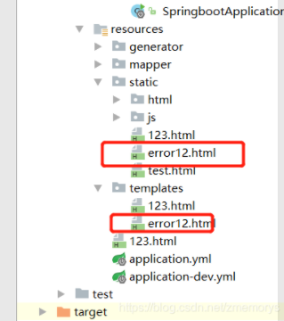
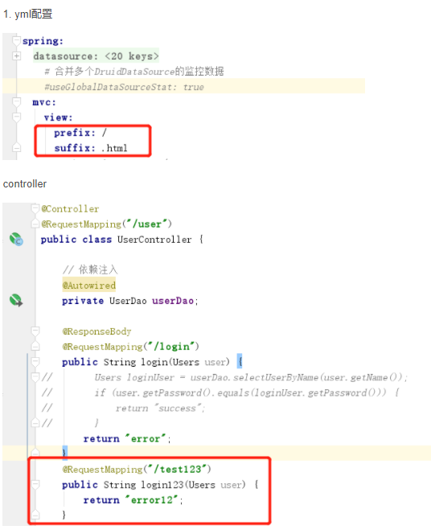
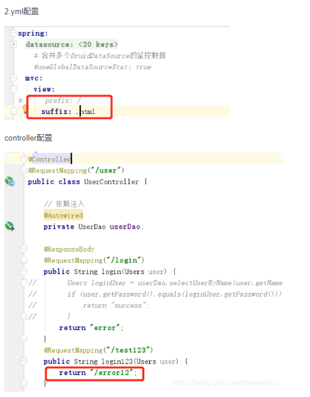
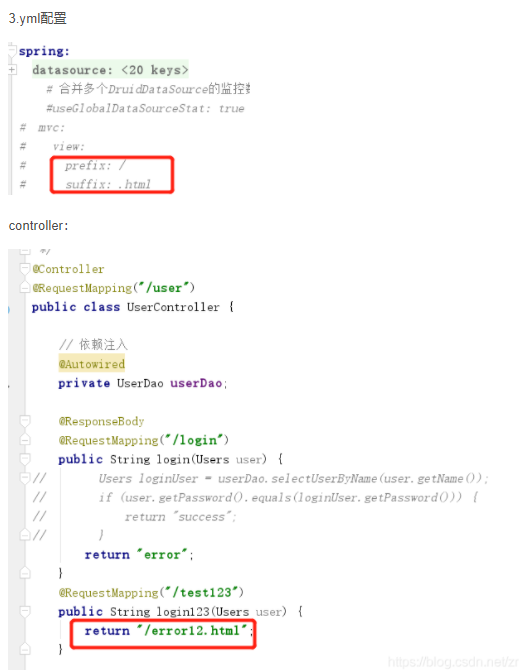
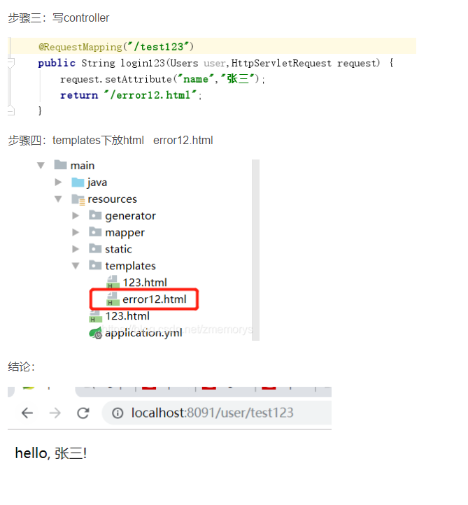
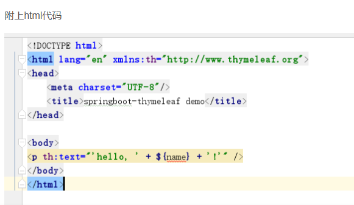

# Bug记录


## maven错误

### Failed to execute goal org.apache.maven.plugins:maven-surefire-plugin:2.22.2

pom.xml中加入以下代码

```xml


<build>
    <plugins>

        <plugin>
            <groupId>org.apache.maven.plugins</groupId>
            <artifactId>maven-surefire-plugin</artifactId>
            <version>2.22.2</version>
            <configuration>
                <skipTests>true</skipTests>
            </configuration>
        </plugin>
    </plugins>

</build>

</project>

```


## 资源路径错误

### 路径访问全解

**不使用模板引擎的时候：**

```yml
# 配置文件
spring: 
  devtools:
    restart:
      enabled: true
      additional-paths: src/main/java
  web:
    resources:
      static-locations: classpath:/static,classpath:/public,classpath:/resources,classpath:/META-INF/resources
  mvc:
    view:
      prefix: /
```

```java
/**
 * @Author: Yan Jingcun
 * @Date: 2021/6/29
 * @Description:
 * @Version: 1.0
 */

package com.jancoyan.commentset.controller;

import org.springframework.stereotype.Controller;
import org.springframework.web.bind.annotation.GetMapping;
import org.springframework.web.bind.annotation.PathVariable;

@Controller
public class MvcController {

    @GetMapping("/workbench/{file}")
    public String workbenchResource(@PathVariable(value = "file") String file) {
        return "workbench/" + file;
    }

    @GetMapping("/workbench/{file1}/{file2}")
    public String workbenchResource(
            @PathVariable(value = "file1") String file1,
            @PathVariable(value = "file2") String file2) {
        return "workbench/" + file1 + "/" + file2;
    }
}

```


使用模板引擎的时候

```yml
# 配置文件
spring: 
  thymeleaf:
    cache: false
  devtools:
    restart:
      enabled: true
      additional-paths: src/main/java
  web:
    resources:
      static-locations: classpath:/static,classpath:/public,classpath:/resources,classpath:/META-INF/resources
  mvc:
    view:
      prefix: classpath:/templates/
```

```java
/**
 * @Author: Yan Jingcun
 * @Date: 2021/6/29
 * @Description:
 * @Version: 1.0
 */

package com.jancoyan.commentset.controller;

import org.springframework.stereotype.Controller;
import org.springframework.web.bind.annotation.GetMapping;
import org.springframework.web.bind.annotation.PathVariable;

@Controller
public class MvcController {

    @GetMapping("/workbench/{file}")
    public String workbenchResource(@PathVariable(value = "file") String file) {
        return "workbench/" + file;
    }

    @GetMapping("/workbench/{file1}/{file2}")
    public String workbenchResource(
            @PathVariable(value = "file1") String file1,
            @PathVariable(value = "file2") String file2) {
        return "workbench/" + file1 + "/" + file2;
    }
}
```


#### 不使用模板引擎的时候




case1：




case2：




case3：




1. “spring.mvc.static-path-pattern”

spring.mvc.static-path-pattern代表的含义是我们应该以什么样的路径来访问静态资源，换句话说，只有静态资源满足什么样的匹配条件，Spring Boot才会处理静态资源请求，以官方配置为例：这表示只有静态资源的访问路径为/resources/**时，才会处理请求

`spring.mvc.static-path-pattern=/resources/**`

假定采用默认的配置端口，那么只有请求地址类似于“http://localhost:8080/resources/jquery.js”时，Spring Boot才会处理此请求，处理方式是将根据模式匹配后的文件名查找本地文件，那么应该在什么地方查找本地文件呢？这就是“spring.resources.static-locations”的作用了。


2. “spring.resources.static-locations”

  “spring.resources.static-locations”用于告诉Spring Boot应该在何处查找静态资源文件，这是一个列表性的配置，查找文件时会依赖于配置的先后顺序依次进行，默认的官方配置如下：

`spring.resources.static-locations=classpath:/static,classpath:/public,classpath:/resources,classpath:/META-INF/resources`

继续以上面的请求地址为例，“http://localhost:8080/resources/jquery.js”就会在上述的四个路径中依次查找是否存在“jquery.js”文件，如果找到了，则返回此文件， 否则返回404错误。

#### 使用模板引擎的时候

1. 引入jar包(当引入这个jar包的时候 默认的静态根目录变成了templates)

```xml
<dependency>
    <groupId>org.springframework.boot</groupId>
    <artifactId>spring-boot-starter-thymeleaf</artifactId>
</dependency>
```

步骤二：application.yml只需要加(开发时禁用缓存)

```yml
spring:
   thymeleaf:
     cache: false
```




### SpringBoot整合jsp的时候访问不到静态资源

springboot 默认的静态资源的值有四个：

- *classpath:/META-INF/resources/*
- *classpath:/resources/*
- *classpath:/static/*
- *classpath:/public/*

如果你没有特别配置静态资源的位置，那么默认的静态资源的位置就是resource 下面的static文件夹，毕竟不用自己新建文件夹

那么你的页面引入的静态文件可以这么写：

` <script type="text/javascript" src="/js/jquery.min.js"></script> `

这样就需要在static下面创建js文件夹，将jqeruy.js放在这个js文件夹下面


## 整合pagehelper的时候查询查询了所有的数据，而不是进行了分页

在SSM中整合pagehelper只需要导入一个依赖，但是Springboot中需要导入三个依赖

```xml
<dependency>
    <groupId>com.github.pagehelper</groupId>
    <artifactId>pagehelper</artifactId>
    <version>5.1.4</version>
</dependency>
<dependency>
    <groupId>com.github.pagehelper</groupId>
    <artifactId>pagehelper-spring-boot-starter</artifactId>
    <version>1.2.5</version>
</dependency>
<dependency>
    <groupId>com.github.pagehelper</groupId>
    <artifactId>pagehelper-spring-boot-autoconfigure</artifactId>
    <version>1.2.5</version>
</dependency>
```

导入这三个插件就可以了

并且如果要用Mybatis-plus进行分页，还要写一个过滤器

```java
/**
 * @Author: Yan Jingcun
 * @Date: 2021/6/28
 * @Description:
 * @Version: 1.0
 */

package com.jancoyan.commentset.config;

import com.baomidou.mybatisplus.annotation.DbType;
import com.baomidou.mybatisplus.extension.plugins.MybatisPlusInterceptor;
import com.baomidou.mybatisplus.extension.plugins.inner.PaginationInnerInterceptor;
import org.mybatis.spring.annotation.MapperScan;
import org.springframework.context.annotation.Bean;
import org.springframework.context.annotation.Configuration;
import org.springframework.transaction.annotation.EnableTransactionManagement;

@EnableTransactionManagement
@Configuration
@MapperScan("com.jancoyan.commentset.mapper")
public class MybatisPlusConfig {
    // 分页拦截器对象，目前分页不支持表连接，只能单表查询
    @Bean
    public MybatisPlusInterceptor mybatisPlusInterceptor() {
        MybatisPlusInterceptor interceptor = new MybatisPlusInterceptor();
        interceptor.addInnerInterceptor(new PaginationInnerInterceptor(DbType.MYSQL));
        return interceptor;
    }
}
```


# uni-app 解决scroll-view下拉刷新无法正常恢复的问题

关于scroll-view组件的下拉刷新，无论是uni-app还是微信小程序，官方都说得不是很明白，有一个非常关键的关键规则没说清楚，组件属性例子：

refresher-triggered="triggered" @refresherrefresh="onRefresh" @refresherrestore="onRestore" scrolltolower="loadMore"

1.**通过程序将triggered设为true时**，将触发onRefresh；

2.**不管triggered为何值，在界面中下拉**，也会触发onRefresh，但不会自动改变triggered值(不能双向绑定，这是问题的根本原因)；

3.onRefresh执行完毕，**不会自动触发onRestore**（这是问题的表现），使得刷新图标一直显示，**必须是triggered由true变为false**，才会触发onRestore并隐藏刷新图标；如果triggered一直为false，或一直为true，都不会触发。

解决办法：

1.在进入onRefresh后，**如果triggered为false，则将它置为true**，当执行完你的刷新操作（通常是获取新的数据）后，**将triggered置为false**。

2.由于上一步中将triggered置为true，会再次触发onRefresh，故需再增加一个_freshing，表示是否正在执行刷新操作，在onRefresh中做判断，如_freshing为true，不执行刷新操作直接返回。

如果scroll-view有多个，要每个用自己的 triggered和refreshing来控制。

```html
<template>
	<view>
		<view class="wrap">
			<view class="u-tabs-box">
				<u-tabs-swiper 
					activeColor="#5098ff" 
					ref="tabs"
					:list="typeList" 
					:current="current"
					 name="typeName"
					@change="change" 
					:is-scroll="false" 
					swiperWidth="750"></u-tabs-swiper>
			</view>
			<u-top-tips ref="uTips"></u-top-tips>
			<swiper class="swiper-box" 
				:current="swiperCurrent" 
				@transition="transition" 
				@animationfinish="animationfinish">
				<swiper-item class="swiper-item" v-for="(comments,index) in commentList">
					<scroll-view 
					scroll-y
					refresher-enabled="true"
					refresher-background="#5098ff"
					:refresher-triggered="triggered"
					@refresherrefresh="onRefresh" 
					@refresherrestore="onRestore" 
					@scrolltolower="reachBottom">
						<u-card v-for="(item,index) in comments" :show-head="false">
							<view class="" slot="body">
								{{item.commentContent}}
							</view>
							<view class="info" slot="foot">
								<view class="author"> {{item.userName}} </view>
								<view class="date"> {{item.postDate}} </view>
								<!-- <view class="like"> 点赞 </view> -->
								<!-- <view class="collect"> 收藏 </view> -->
							</view>
						</u-card>
						<u-loadmore :status="loadStatus[0]"  bgColor="#f2f2f2" :load-text="loadText"></u-loadmore>
					</scroll-view>
				</swiper-item>
			</swiper>
		</view>
		
		<u-tabbar :list="tabbar" :mid-button="true" active-color=#5098FF></u-tabbar>
	</view>
</template>

<script>
export default {
	data() {
		return {
			triggered: true,
			// 默认是 false
			_freshing: false,
			
	},
	onLoad() {
		// 获取所有分类和每一个页面的数据
		this.getTypeList();
		// 必须在这初始化
		this._freshing = false
		this.triggered = true
	},
	onReachBottom() {
		this.reachBottom();
	},
	methods: {
		onRefresh() {
			this.debug("in Onrefresh")
			if (this._freshing) return
			if(!this.triggered) this.triggered = true
			this._freshing = true
			this.currentPage[this.current] = 1
			this.maxPage[this.current] = 1
			this.getCommentList(0, this.tabAndType[this.current], this.current)
			setTimeout(() => {
				this.triggered = false;
				this._freshing = false;
				this.$refs.uTips.show({
					title: '已刷新 o(〃\'▽\'〃)o',
					type: 'success',
					duration: '1000'
				})
			}, 1000)
		},
		onRestore() {
			this.debug("restore")
			this.triggered = false // 需要重置
			this._freshing = false // 需要重置
		},
};
</script>

```

