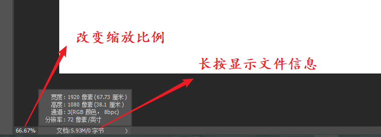
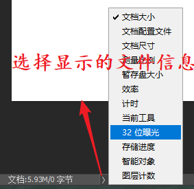
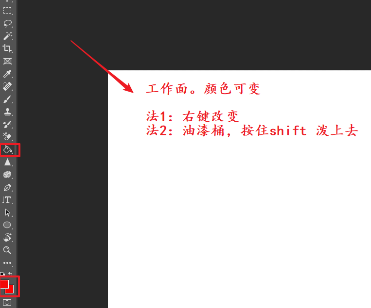
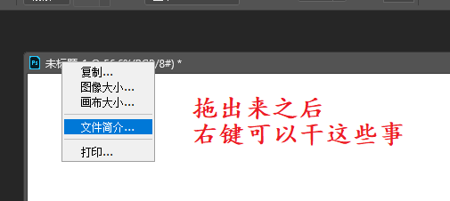
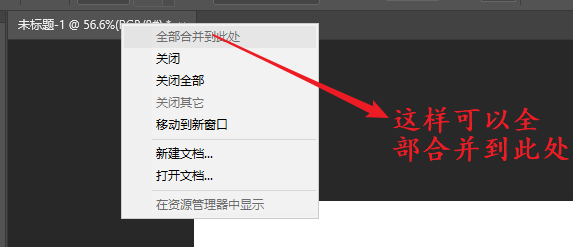
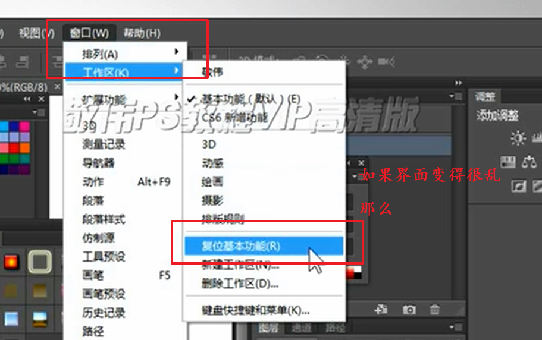
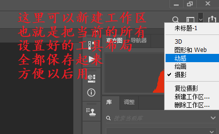

## 前期准备

### 主界面

### 文档

#### 分辨率

分辨率尽量大，但是大了的话也会使文件的体积变大

点分辨率（Dot Per lnch）DPI衡量输出（设备）精度的主要参数

- 打印高DPI需要高PPI和高级纸张
- 常见的屏幕物理DPl多为96

线分辨率（Line Per Inch）LPI 衡量印刷精度的主要参数

- 不同纸张设定不同LPI
- PPI要设定为LPI的两倍

常用分辨率设置（像素）：

- 洗印照片 300或以上
- 杂志，名片等印刷物 300
- 海报高清写真 96-200
- 网络图片，网页界面 72/96
- 大型喷绘 25-50

#### 颜色

RGB 从颜色发光原理来设定，红绿蓝混合，用于显示屏
网页、网络图片、视频素材、3D贴图
CMYK 印刷颜色 青色、品红、黄色、黑色进行混合，用于印刷
宣传册、海报、单页、大型喷绘等

颜色位数：8/16/24 一般选8位就好， 16/24是研究用的

#### 背景透明的表现形式

#### 图像大小

勾选了缩放样式(在在小齿轮里)之后，在图形缩放的时候，图层样式也会跟着成比例放大和缩小

约束比例（长宽旁边的小锁）：限制长宽比

重定图像像素：像素被固定，当改变文档的长、宽、分辨率的时候，另外的属性也会随之变化

自动：画面的总像素 = 高（英寸）* 宽（英寸）* 分辨率（像素/英寸）^2

#### 存储格式

- psd  PS的标准格式，包含颜色，通道，图层，动画等， 原始文件
- psb  ps的大型文件格式 像素可达30w

隐藏文件之后，再保存的时候文件会变小，方便传输

#### 性能

在首选项(Ctrl + K)中

- 暂存盘。PS在工作的时候会产生一个临时文件，数据量大，内存装不下要有个缓冲盘，不建议设置为C
- 历史记录状态。记录的最多历史记录次数
- 文件处理-自动存储设置可以设置自动保存的间隔时间

快捷键设置（尽量用默认的）

菜单栏 -> 编辑快捷键，其中可以更改所有操作的快捷键

可以自行修改所有的快捷键，也可以将一套快捷键保存为一个配置文件，可以在别的电脑上使用了。

### 图层

#### 创建

图层类型：

- 普通图层
- 背景图层
- 智能对象图层
- 调整图层
- 填充图层
- 视频图层
- 矢量图层
- 3D图层
- 文字图层

创建图层：

- 直接点击图层工作区的新建-普通图层
- 按住 alt 再点击， 是详细选项
- 菜单栏图层-新建也可
- 快捷键也可 Ctrl + Shift + N

**双击**名字的**文字**可以改名字

按住alt，点击图层旁边的小眼睛 - 只显示选中的图层，再次点击就恢复了。

选中之后才能拖拽，拖拽改变图层排列次序（Ctrl+【/】也可以将图层上移一层或者下移动一层，Ctrl+Shift+【/】可以直接移动到最上面或者最下面），排列次序影响视觉效果。

复制图层

- 菜单栏-图层-复制 高级复制
- 按住alt拖拽图层 直接复制为副本（可以同时复制多个图层）
- 复制图层**不能用Ctrl + C**（Ctrl + C的意思是复制当前选区，并新建一个图层来存放当前选区）

删除：直接delete

### 查看图片方式

抓手工具（单击 H）

双击抓手工具显示全部图像

双击缩放工具显示原图

缩放工具的时候按住鼠标向左向右移动可以快速的放大和缩小

也可以右键图片进行缩放

放大/缩小（Ctrl + +/-）

无论当前的工具是什么：

- 空格 + Alt 同时按下，召唤出临时缩小工具，空格 + Ctrl是放大工具（**最方便**）

## 工具详解

### 移动工具（V）

拖拽一个文件中的图层到另一个文件中-复制

- 文档大小相同，在拖动，将要松手的时候按下shift，可以让原来的图像保持原位
- 文档大小不同的时候回自动居中
- 如果目标文档包含选取，就会到选区中央

自动选择状态下，在透明区域内可以使用选框选择图层，这样可以同时移动多个图层

大多数时候都是用按住Ctrl的方法进行移动的。

**按住Alt**拖动图层 --> 将当前图层复制一份到指定位置

**按住Shift**拖动图层 --> 锁定图层移动的方向

上下左右箭头可以进行微调，加上Shift，步长加大

---

对齐按钮，需要选择多个图层

默认情况下，目标侧的图层固定，其他图层移动找齐

两图层垂直对齐，怎样选择使一个追随另一个来对齐，而不是共同向中间靠拢？

- 先将两图层进行链接，然后选择其中一个图层，则未选中的向选中的图层移动对齐

### 选区和选框工具

选区内的像素可被编辑和移动

选取是临时性的，但可以存储在文件（的通道）里面（用右键）

单行和单列选区是选择一行或者一列的一个像素条（可以羽化）

### 套索和魔法工具

套索

- 用backspace或者delete可以取消套索工具的上一步选择
- 在套索工具中，使用多边形套索的时候按住Alt键可以使用自由套索
- 多边形套索工具，首尾接近的时候光标出现**小圆圈**的时候，再次点击可以闭合。（也可以双击、按住Ctrl左击、回车）

多边形套索可以画到外边、自由套索工具不能。

多边形套索适合直线选择。

Ctrl + Shift + J 通过剪切的图层（将图层剪切到另一个图层上面）

磁性套索

- 磁性套索可以自动识别像素的边缘
- 选项频率是识别像素边缘的控点的频率

魔法选择工具（W）

- 魔棒选择颜色相近的区域
- 选项 - 连续 - 取消之后会把图层上的所有的颜色相近的图层都选中

色彩范围的用法和魔棒差不多。

魔棒工具也有局限性，一旦需要分离颜色差不多的颜色就不行了。

快速选择工具，比较好。

调整边缘就是选择并遮住。

选区可以有透明度

为选区填充颜色：

- Alt + Delete 多次填充前景色

选区可以变成路径。

### 历史工具

历史画笔工具，使用画笔的形式对历史进行部分恢复

历史记录面板的这个画笔可以设置历史记录画笔的源，也就是使用画笔将这张图的哪个部分恢复到源的状态

### 画笔工具

#### 画笔工具

使用方法:

- 直接拉动
- 按住Shift拉动，可以画出来**直线**
- 按住Shift点击起点和终点（递归点击），可以画出来连续的直线
- 改变前景色，改变画笔的颜色
- 画笔状态按住Alt，吸取当前颜色变为前景色
- Shift + Alt + 鼠标右键  可以使用HUD拾色器

#### 画笔预设

画笔状态鼠标右击，召唤预设面板，改变画笔的大小、硬度

【、】或者Alt + 鼠标右键左右移动 改变画笔的大小

Shift + 【、】 或者鼠标右键上下移动改变画笔的硬度

可以自定义笔刷：

编辑 --> 定义画笔预设，就是将当前**图层**转换为画笔。

#### 铅笔工具

铅笔的笔带有锯齿

#### 橡皮擦工具

**学会了蒙版之后，橡皮擦几乎不用，**

**实际工作中不建议使用**

橡皮擦：擦到背景

背景橡皮擦：擦除背景，得到主题图像，图标中心要留在背景上

- 这个的高级功能还挺有用的，自己可以摸索一下。

魔术橡皮擦：擦除颜色相近的工具

### 修复工具

锐化和模糊效果无法转换

模糊工具会改变、损失很多原有的像素信息

涂抹工具和画笔一样使用就行。

减淡工具

- 保护色调可以保护图像在使用减淡时防止色调失真

加深工具

仿制图章工具

- 先使用Alt + 鼠标左键进行位置的选区
- 再在要复制的地方用“画笔”进行“复制”
- “对齐”选项取消之后，鼠标松开之后刷新复制起点
- 当前和下方模式可以定义当前及下方图层的图像为源，其他选项以此类推
- 可以跨文档进行

图像图章工具和仿制图章差不多，只不过是自己选择一个图片作为模板，对当前图像进行擦除之后显露模板的样子

修复画笔工具和仿制图章差不多

- 和仿制图章共享源
- 有一定的智能性，可以和周围环境进行融合

污点修复画笔 - 修复小“污点”

- 类似于选区大面积像素用来平均污点周围像素值

修补工具 - 修复大“污点”

- 建立选区 ==》鼠标拖拽

内容感知移动工具

- 建立选区 ==》 移动

红眼工具

- 直接框出来就行了

### 颜色和图案的填充

建立选区之后，填充在选区内进行

油漆桶用来填充颜色相近的区域（可以选择容差）

填充：Shift+F5 或者 Shift + BackSpace

填充背景色：Ctrl + Del

渐变工具：

- Shift锁定角度
- 双击展示色块可以进行相关的编辑

### 自由变换

Ctrl + Shift + Alt + T 重复上一次变换操作并复制到新的图层

自由变换模式下按住Ctrl键快速进入扭曲模式

### 通道和蒙版基础知识

通道：

RGB通道由红绿蓝三个通道构成，每一个通道都用灰度图像来表示每个像素颜色的强度（也可以设置为用有颜色的图像，但那样不好看），区域颜色越白表示通道中颜色的强度越强。

不同的颜色模式的通道不同

通道面板上最多能有56个通道

Alpha通道：记录透明度信息的特殊图层

- 黑色不包含像素信息，代表透明；白色代表100%像素覆盖，代表此处是不透明的实色区域 
- 一般情况下用8位通道即2的8次方，256种色阶，0~255，0是黑色透明，255是白色不透明，1~254表示灰色半透明

- Ctrl + 点击Alpha通道，在当前通道载入被点击通道的选区。 
- 通道的编辑方式和图层一样，灰阶像素的调整和形状的编辑，就是为了得到相应的选区。

按住Shift点击蒙版可以快速启用和停用蒙版

做好选区之后按Q可以进入快速蒙版模式，直接在原图上添加图层蒙版

### 图层进阶

### 色彩基础

### 亮度与色阶看懂直方图

### 曲线和色彩平衡调色

### 钢笔工具

### 文字处理工具

### 实用的辅助工具

### 批量处理大量图像

### 3D图像特效

### 视频动画

