## 准备


虚拟机的两种联网方式：

- 桥接
- NAT（建议）

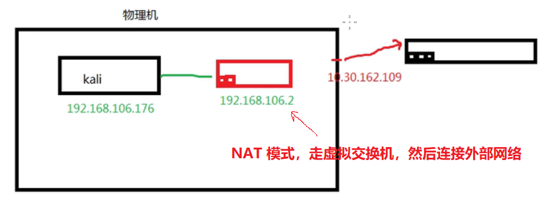


虚拟机网络改成桥接

然后重新设置虚拟机的ip


```
dhclient -r eth0 # 释放eth0的ip
dhclient -v eth0 # 重新获取ip
# 如果不行就直接  dhclient eth0
```


### OWASPBWA的使用

进入系统之后会显示以下内容

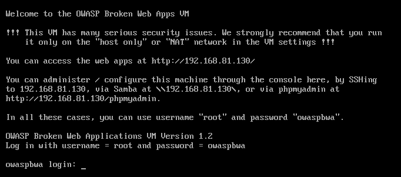

可以访问  [http://192.168.81.130](http://192.168.81.130) 访问webapp

可以通过SSH连接 【192.168.81.130】 到这个系统

在电脑中命令行通过 \\\\192.168.81.130 访问到共享文件夹 

通过 [http://192.168.81.130](http://192.168.81.130/phpmyadmin) 访问到系统管理页面

以上所有访问的用户名均为 `root` 密码为 `owaspbwa`


我们一般用 ssh 连接 owa靶机，用图形界面操作kali

开启kali的ssh连接

```bash
lsof -i :22
service ssh start
systemctl enable ssh
```


如果VMWare的服务没有启动，那么可能是因为Windows中的VMWare的DHCP服务没有启动。


以下两个是常用的靶机

- [Damn Vulnerable Web Application](http://192.168.81.130/dvwa)

- [OWASP Mutillidae II](http://192.168.81.130/mutillidae)


### 文件上传漏洞渗透及防御


```
OWASP Broken Web Applications Project Broken Web Applications（BWA）项目生成一个虚拟机，运行各种

具有已知漏洞的应用程序，供以下人员使用：

- 了解Meb应用程序安全性
- 测试手册评估技术
- 测试自动化工具在编中0.00KB/S
- 测试源代码分析工具
- 观察网络攻击
- 测试MAF和类似的代码技术
```


本实验 使用 http://192.168.81.130/dvwa/vulnerabilities/upload/

文件上传漏洞：

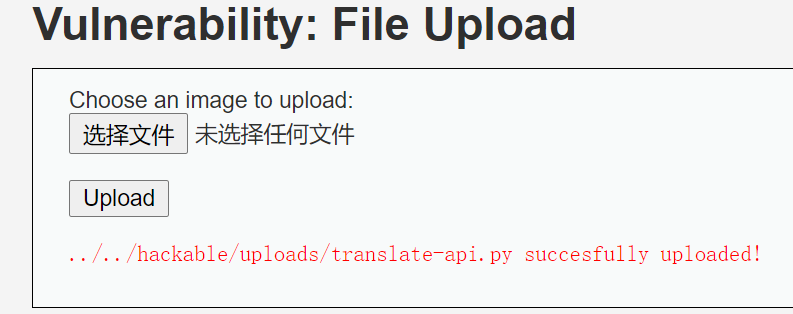

从图中可以看到，上传文件的时候没有做校验，导致上传 py 脚本成功

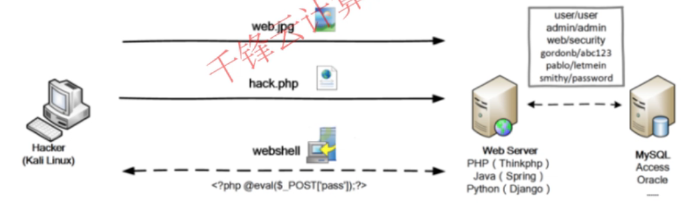

1、文件上传（File Upload）是大部分Web应用都具备的功能，例如用户上传附件、修改头像、分享图片/视频等

2、正常的文件一般是文档、图片、视频等，Web应用收集之后放入后台存储，需要的时候再调用出来返回

3、如果恶意文件如PHP、ASP等执行文件绕过Web应用，并顺利执行，则相当于黑客直接拿到了Webshe11

4、一旦黑客拿到Webshe11，则可以拿到Web应用的数据，删除Web文件，本地提权，进一步拿下整个服务器甚至内网

5、SQL注入攻击的对象是数据库服务，文件上传漏洞主要攻击Web服务，实际渗透两种相结合，达到对目标的深度控制


**低安全级别：服务器可以接受任何类型任何大小的文件。**

如果上传的文件是恶意的文件，我们就可以用一句话木马上传到web，然后用中国菜刀进行渗透，拿到网站的权限。

编写木马

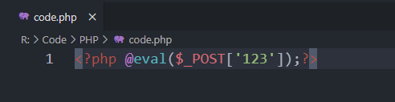

```php
<?php @eval($_POST['123']);?>
```

上传木马

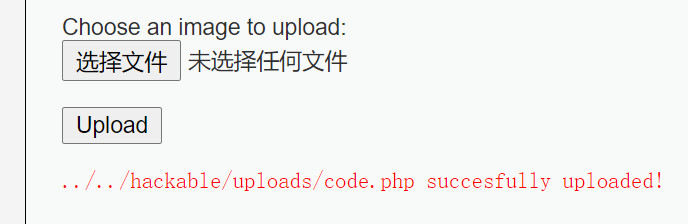

用中国菜刀进行连接

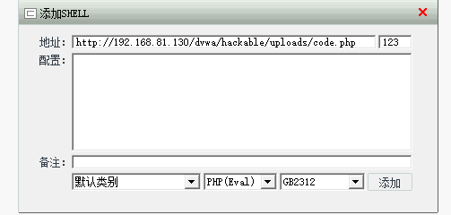

添加之后就拿下了网站的后台

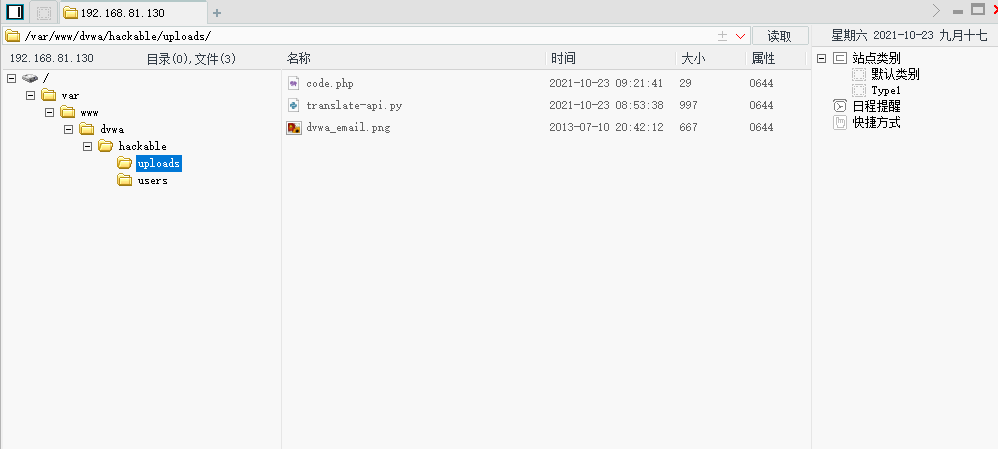

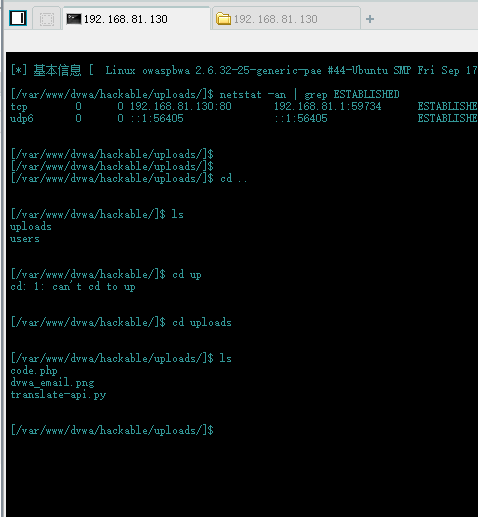

**中安全级别**

设置安全级别

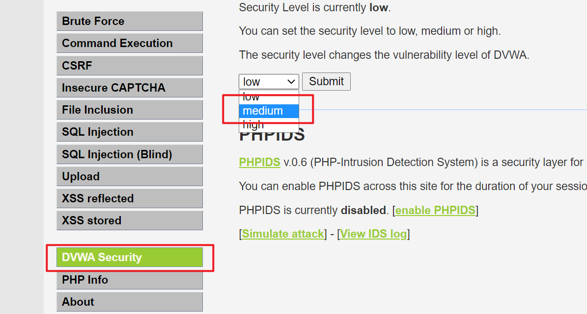

**中安全级别：设置允许接受的mime类型，对不是指定类型的请求进行拦截**


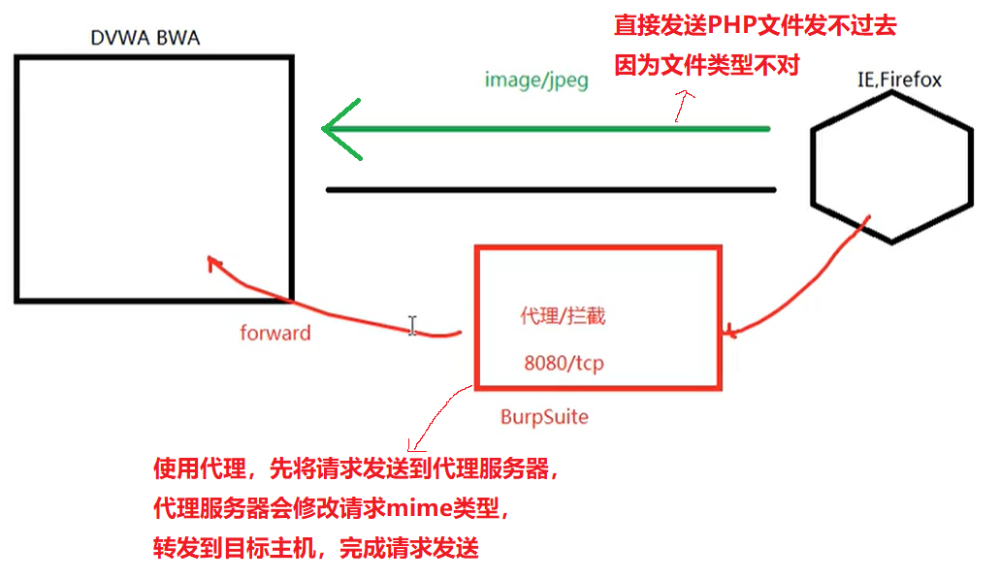

此时我们需要 burp suite 提供代理服务器

首先在浏览器的网络设置中设置网络代理，将代理功能指向BurpSuite：

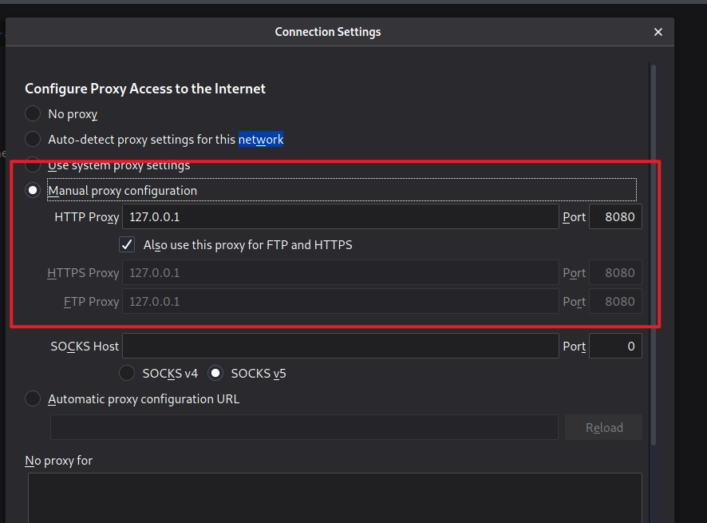

此时在访问网站的时候会显示 “代理服务器拒绝了连接”

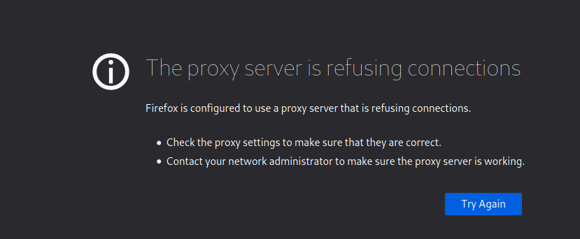

