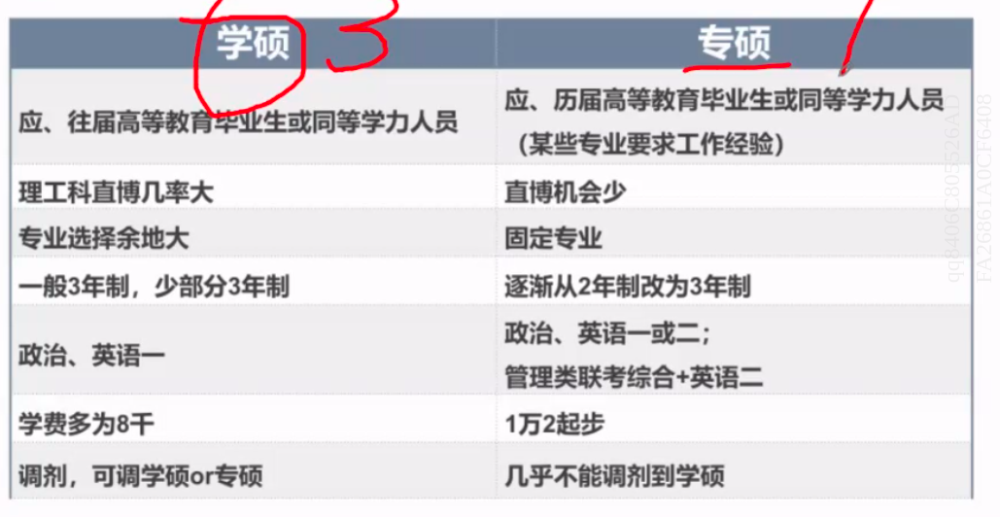

哲学没有专硕

直博：硕博连读

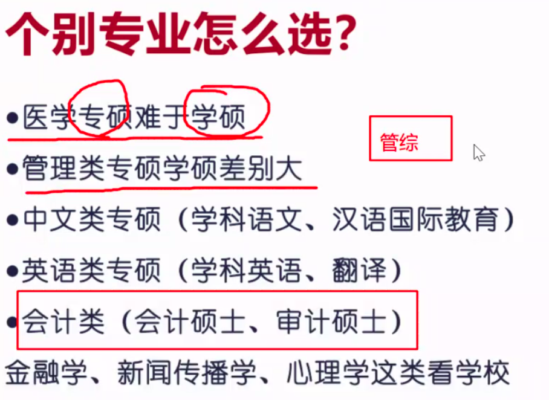

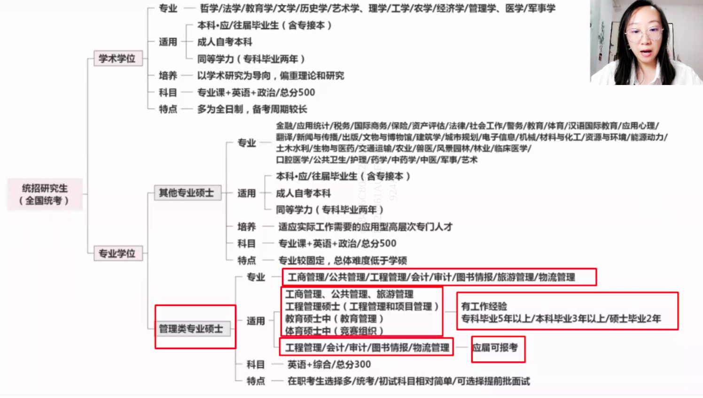

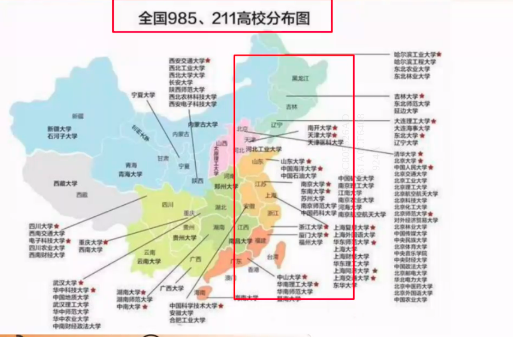

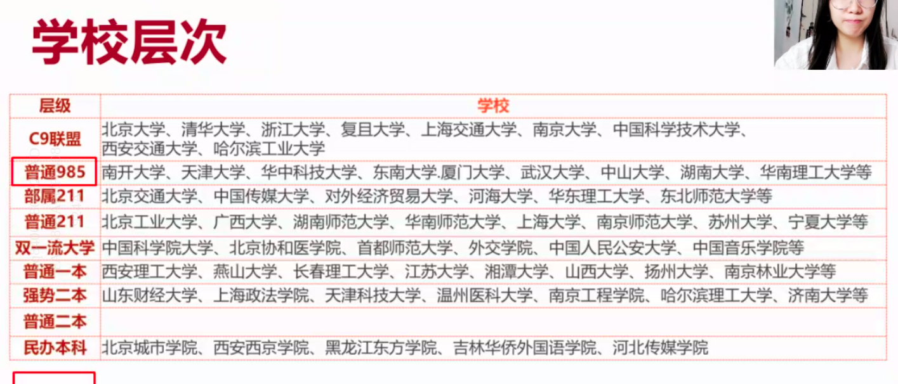

选学校的时候，5个人以下的不考虑

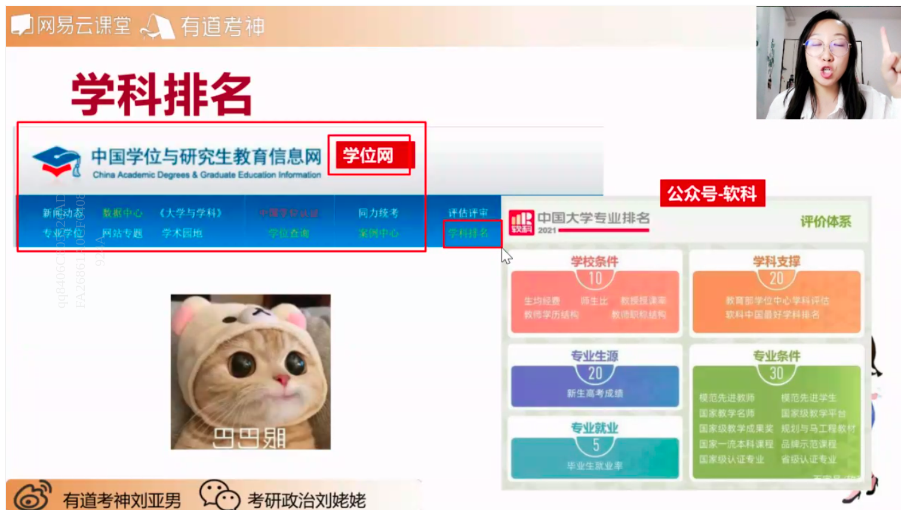

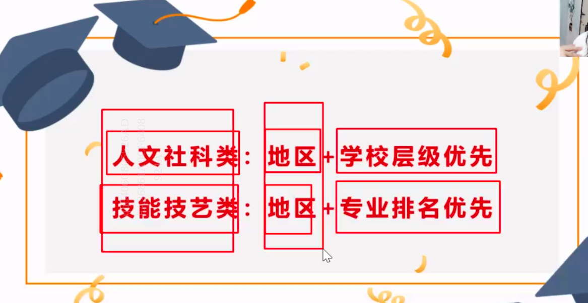

报录比存在不小的误差，可能存在大小年，不太可信，而且有些学校不给报录比

千万不要看1819年的数据

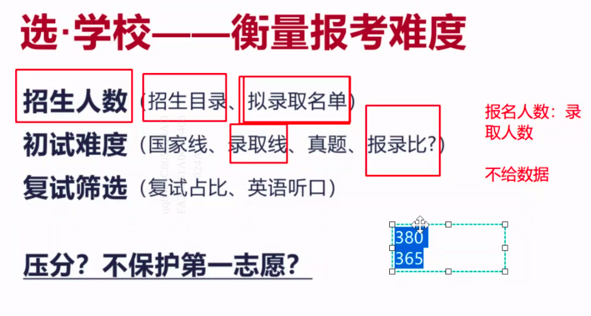

**重点看拟录取的名单：看拟录取名单的学生的总成绩或者专业课成绩**

有的学校给分给的低，有的学校给的高，有的压分有的提分。

**选学校的时候要看学校的专业课真题！！！**

陆续往下筛！！！然后筛到2、3个之后拿出来学校的真题

看学校的真题！！看看做得顺不顺手！！

看学校的初试和复试的比例

复试千万不要提前准备！！只要初试能够，复试基本没问题

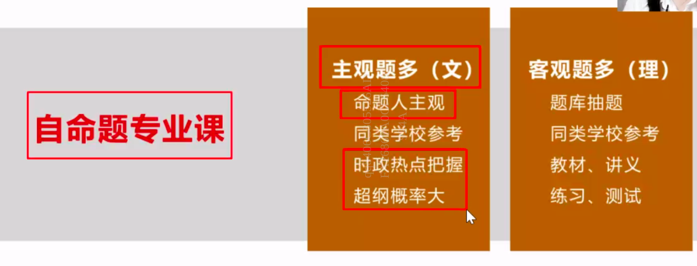

408的题都是一样的，

自命题的不一样

所有资料先从官方找招生简章

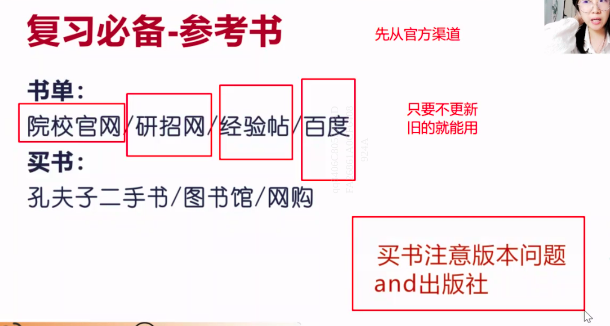

如果没有指定参考书

- 以前的参考书单
- 真题
- 同层次学校同专业参考书
- 本科教材&拓展读物
- 学科内经典书目

真题怎么找？

- 官网、研招办(接电话的大概是个学生，如果是个学长学姐，加微信！沟通！利用！！！)、学长学姐、论坛
- 考研练习册、本科练习册

辨别资料贩子：找个小号，要别的学校的真题，如果有，那八成是个骗子。

知乎：篇幅比较少的，概率比较大；篇幅大的，可能是【写手】。

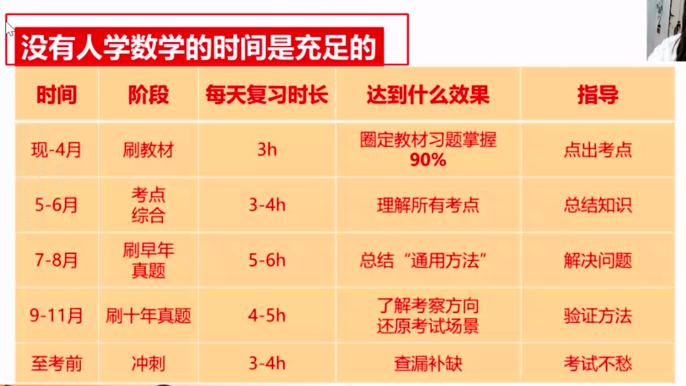

数学只有【不会】和【高分】

**考研政治**

容易题 80 分，平均分 57 - 59

政治保70冲80！！！！

英语保80冲90！！！！

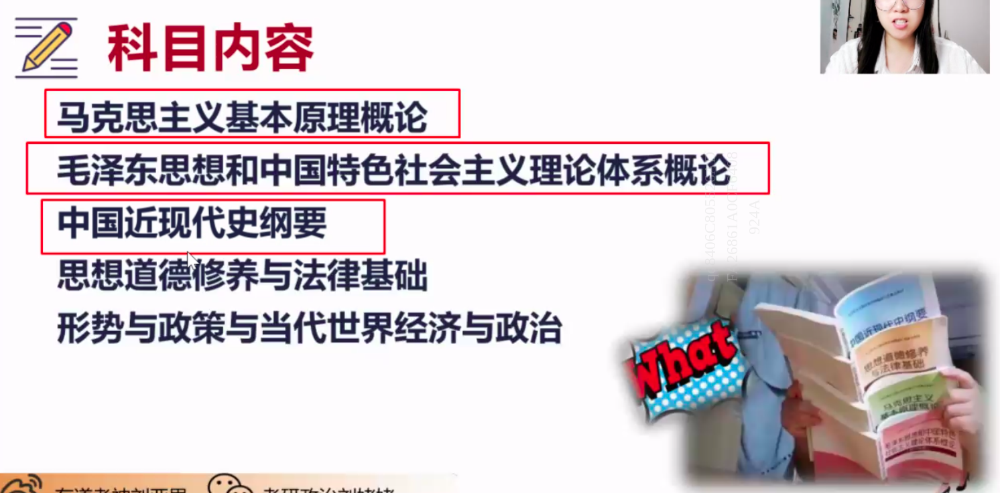

---

按照学科实力和考研难度，计算机的考研院校基本上可以分为以下5个梯队

> 第一梯队：热门地区+强势专业+强势985或学科实力强劲的211；

清华大学，北京大学、浙江大学，北航、北邮，上海交通大学，同济大学，南开大学、北京理工大学，电子科技大学、武汉大学等;

> 第二梯队：热门地区+优势专业+普通985或学科实力不错的211；

西安交通大学、西南交通大学、北京科技大学、四川大学、东南大学、西安电子科技大学、暨南大学、中国人民大学、上海大学、南京师范大学等；

> 第三梯队：普通地区+优势专业+学科实力强劲的双非或普通211；

中国石油大学，南京航空航天大学，深圳大学、杭州电子科技大学、西北工业大学、华北电力大学等；

## 第一梯队

## 第二梯队

西安交大：

西南交大

西电

## 第三梯队

