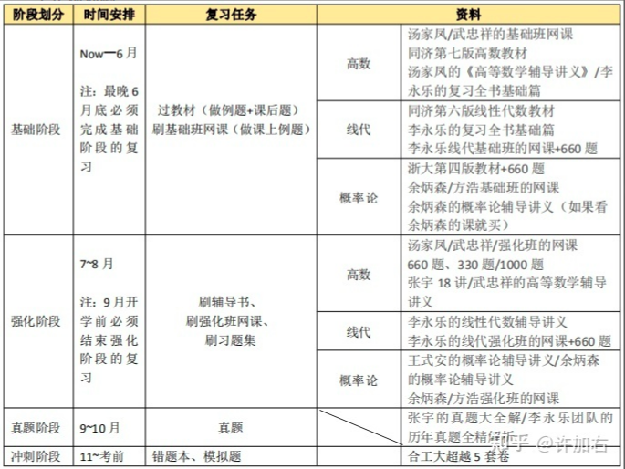

# 考研数学一复习

数学没有人能复习完！!!越早准备越好!!!

---

## 最终规划

**前期【基础】【6月之前】：**

【教材+教材例题+网课+网课例题】【教材+教材例题+网课+网课例题】

课程：

- 【高数】教材+基础看汤家凤或武忠祥老师的课
- 【线代】教材+李永乐现代基础班+660
- 【概率论】教材+660+（余炳森+余炳森辅导讲义）或方浩基础班

- （可以配套1800）

**中期【狂刷】【7~8月】：**

- 【高数】汤/武 强化班 + 660、330、1000 + 张宇18讲/武忠祥的高数讲义
- 【线代】李永乐线代强化班 + 李永乐线代讲义 +  660
- 【概率论】

**后期【真题】【9~11月】：**

- 张宇 或者 李永乐

**冲刺【11月~考前】：**

【合工大超越5套卷】【合工大超越5套卷】【合工大超越5套卷】

## 细节处理

错题怎么搞？

哈希索引

## 他山之石

### 21上岸中科大软院424分的巨佬：

考研数学不需要看教材

前期：杨超高数基础班+方浩高数强化班+李永乐线代强化班（配合1800基础篇）

中期：武忠祥高数强化班+李林线代强化班+方浩线代强化班（配合880整本），完成后用660整本作为检验

后期【9月之前】：真题87-20所有，用书是参考了高教社真题+李范真题+李永乐真题+考试中心的数学分析，这几本习题的解析是各有千秋，年底的时候如果有人问怎么选真题模拟题我再细说。模拟题，按时间顺序是李正元400+张8前两套+李林6+李林4+高教社3+张宇4，考数学前一天晚上在酒店做的张4最后一套。

**强化班看张宇的课程，**

**线代必跟李永乐，**

**概率论跟余炳森或方浩。**

关于真题：

和模拟题放在一起作为套卷，可长可短，依赖于前面的复习效果。

评论区有问基础阶段应该做什么题。<b>其实用什么书做什么题都不是最主要的，你用的书牛逼不代表你就会牛逼。</b>这个问题我没考前复盘的时候就想过，如果重来我会怎么选书和题。我认为应该这样<b>每个月你做一次规划，然后针对这个规划选这个月做什么题，月底看看选这本题的目的实现了没？没实现就去想想问题出在哪。不要一门心思抓住一套题像信仰一样。</b>所以怎么选看自己，不要抄学长学姐的作业。下面我就罗列一下优缺点你自己选比较好。

---

### 21上岸北邮442分的巨佬：

> 数学的学习时间要占据整个备考时间的一半以上

> 小题会考一些基础的、零散的、小的点（概念）

错题的积累：拿一个本子记录索引！！！！！标明这个题目是在哪本书的第几页，什么类型的，当时怎么错了。

所有的教材以官方给的教材为准

建议第一轮用660和复习全书，660完了之后做张宇的1000ABC

第二轮用

后期精做15年左右的真题

11月开始模拟题：李正元400题（质量高但是计算量大），李林6+4，李永乐6，

不推荐张宇8+4

考前会有各种傻逼卖泄题的题，不用理他们。

---

### 21上岸北交大的大佬

> 一定要拿出来一整块的连续的时间来复习数学

题库介绍：

全书：复习全书、张宇的36讲、线性代数辅导讲义、概率论辅导讲义、高等数学辅导讲义等，包含了知识点、例题、习题。

习题集：李永乐的660题、张宇1000题、汤家凤1800题、李林880题等，专门用于刷题的书。

真题：张宇的真题大全解、李永乐的历年真题全精解

模拟题：6+4等

错题：一开始就得分类记录。可以记在本子上，也可以记在电脑上。

**高数汤家凤、线代李永乐、概率论余炳森**

**第一轮【基础】：**

网课：汤家凤基础班+李永乐基础班+余炳森基础班

教材：最好能看看

习题：

【重点看课本例题、讲义例题和习题】【重点看课本例题、讲义例题和习题】

在把课本和讲义的题做透做懂之后再考虑要不要增加新题（一般人是加不上的，因为还有线代和概率论

【高数】 
以《高等数学辅导讲义——汤家凤》和教材的例题为主，精做精炼。 
可以搭配汤家凤的1800题或者李永乐的660题；建议李永乐的660，因为辅导讲义的题量已经很大了。

【线代】 
以《李永乐复习全书基础篇》和教材的例题为主，精做精炼。 
如果不够，就加上李永乐的660，因为辅导讲义的题量已经很大了。

【概率论】 
以《概率论辅导讲义——余炳森》和教材的例题为主，精做精炼。 
不够就再加上李永乐的660

*详细的具体步骤*

1. 先看教材，不懂的地方标记出来

2. 做课本的例题，做之前回忆一下定理的使用条件

3. 做课本的课后题（不用全都做，只做相同类型的）

4. 再做例题（可选）

5. 先做讲义上的例题，再听基础班的课，听课的时候不用大记笔记，因为大多数笔记都在讲义上

6. 听完之后把课上讲的例题做一遍，尤其是重点题型中的题。

**第二轮【强化】：**

网课：汤家凤强化班

